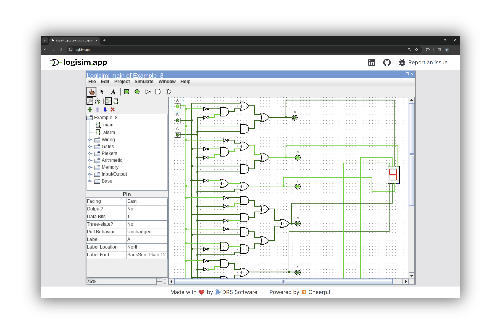
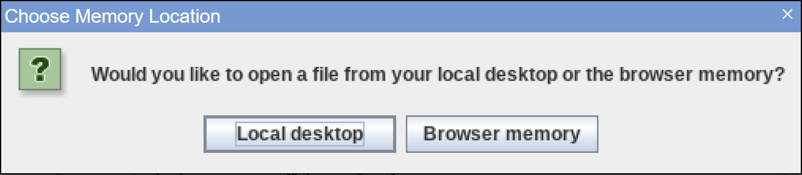

# Logisim.app - Classic logisim ported to the browser

<p style="text-align:center">
<picture style="height:50px;">
  <source media="(prefers-color-scheme: dark)" srcset="./public/images/logisim.app.dark.svg">
  
</picture>
<p>

<p style="text-align:center">
  [👉 Try it here](https://logisim.app/) · [📖 Read the announcement](https://drs.software/blog/announcing-logisim)
</p>

[Logisim.app](https://logisim.app) is a fully featured browser-based port of classic [Logisim](https://www.cburch.com/logisim/): a widely used educational tool for designing  and simulating digital logic circuits.



This project is a complete 1:1 port of the original Java application (based on version 2.7.2) running in the browser powered by [WebAssembly](https://webassembly.org/). It uses [CheerpJ](https://cheerpj.com/) (a complete browser runtime for Java apps) to execute the compiled JAR file directly in the browser. It also includes a lightweight JavaScript layer to provide browser-compatible file operations.

This allows Logisim.app to be used in any modern browsers and devices (including mobile!) without the need for installation or a Java runtime environment.

## Documentation

Since this project doesn't change any of Logisim's core features, you can refer the documentation built into the application and the [original logisim documentation](https://www.cburch.com/logisim/docs.html) for usage details.

### Working with Files
Logisim.app allows you to work with files from your local computer, or from a virtual filesystem in the browser (implemented on top of IndexedDB).

Whenever you try to open or save a file, you will see the following prompt:



- **Local desktop** refers to your computer's file system.
- **Browser memory** refers to the virtual file system in the browser.

Once a file has been opened, the application functions equivalently in both cases.

[!NOTE]: All files stored in the virtual filesystem in the browser are cleared if you delete site data for logisim.app.

## Building and Running Logisim.app

This project contains:
- A copy of the original [Logisim source code](https://sourceforge.net/projects/circuit/), minimally modified to sypport file handling in the browser.
- A lightweight HTML/CSS/JS frontend.

### Dependencies

To build and run it, you'll need:

- [Python 3+](https://www.python.org/downloads/)
- Java 8+ (Any recent version of [OpenJDK ](https://openjdk.org/install/) should work)
- [NodeJs](https://nodejs.org/en/download/)


### Running the application locally
To run the repo locally, clone this repository and use npm to run a local dev server:

```sh
git clone https://github.com/De-Rossi-Consulting/logisim-legacy-wasm.git
cd logisim-legacy-wasm
npm install
npm run dev
```

If everything is working, you should see something like the following:

```
> logisim-legacy-wasm@0.0.0 dev
> vite


  VITE v6.2.5  ready in 671 ms

  ➜  Local:   http://localhost:5173/
  ➜  Network: use --host to expose
  ➜  press h + enter to show help
```

If you want to modify the java files, you will need to **build the `.jar` file**.

### Building the `.jar` file

To build the `.jar` file, run the `create-jar.py` script included in the original source code:

```sh
python3 /PATH_TO_REPO/logisim-legacy-wasm/logisim/scripts/create-jar.py -d /PATH_TO_REPO/logisim-legacy-wasm/public
```

[!NOTE]: Make sure to replace `PATH_TO_REPO` with the absolute path to the repositry directory

This will build the `.jar` file and place it in `/public`, and you can reload the application to see your changes.

## Contributing

Pull requests and issue reports are welcome!Please use [GitHub Issues](https://github.com/De-Rossi-Consulting/logisim-legacy-wasm/issues/new/choose) to report any bugs or problems you encounter.

## Licence

Logisim.app is licensed under the GPLv2, see [LICENSE](./LICENSE) for details.

## Contact

This project is maintained by [DRS Software](https://drs.software/).

Website: [https://drs.software](https://drs.software)

Contact: [info@logisim.app](mailto:info@logisim.app)